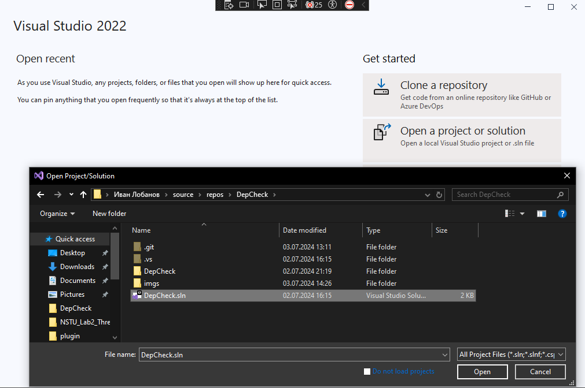
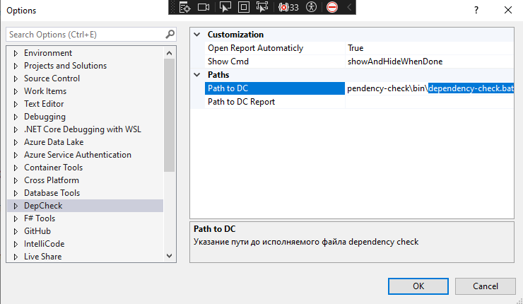
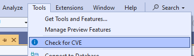
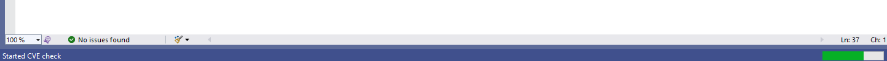
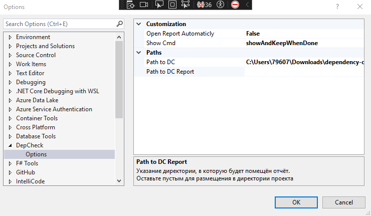
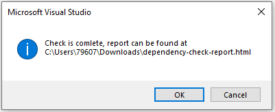
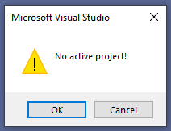
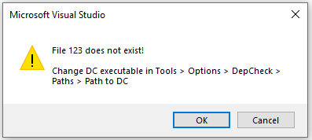
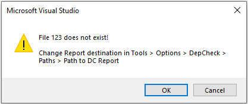
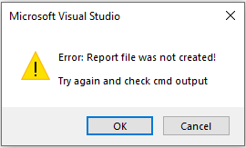

# Dependency Check

Расширение для IDE Visual Studio 
Запускает [ OWASP Dependency Check](https://github.com/jeremylong/DependencyCheck) для открытого в данный момент проекта (.sln)

## Запуск расширения

1. Склонировать репозиторий и открыть решение **DepCheck.sln** в Visual Studio

2. Запустить решение (f5 или Ctrl+f5). Откроется новое окно Visual Studio, в котором нужно открыть проект для анализа (можно также открыть DepCheck.sln)
3. Перейти в *Tools > Options > DepCheck* и указать в опции **Path to DC** путь до испольняемого файла *dependency-check.bat*

4. Закрыть окно с опциями. Во вкладке Tools нажать на **Check for CVE**

 
Это запустит проверку выбранного проекта на уязвимости. Откроется терминал, отображающий вывод dependency-check. По завершении проверки терминал закроется, а составленный отчёт откроется в браузере.

## Реализованные фичи

- Прогресс бар во время работы расширения 

- Настройки
  - Настройка автоматического открытия отчёта по завершении сканирования
  - Настройка отображения окна cmd во время работы расширения
  - Указание исполняемого файла
  - Указание директории, в которую положить отчёт 

- Увдомление об окончании сканирования при выключенном автоматическом открытии отчёта 

- Некоторые проверки на некорректное поведение

  - Не выбран проект 
  
  - Указанный исполняемый файл не существует 
  
  - Указанная для отчёта директория не существует 
  

- Ошибка в случае, если не удалось создать отчёт 
